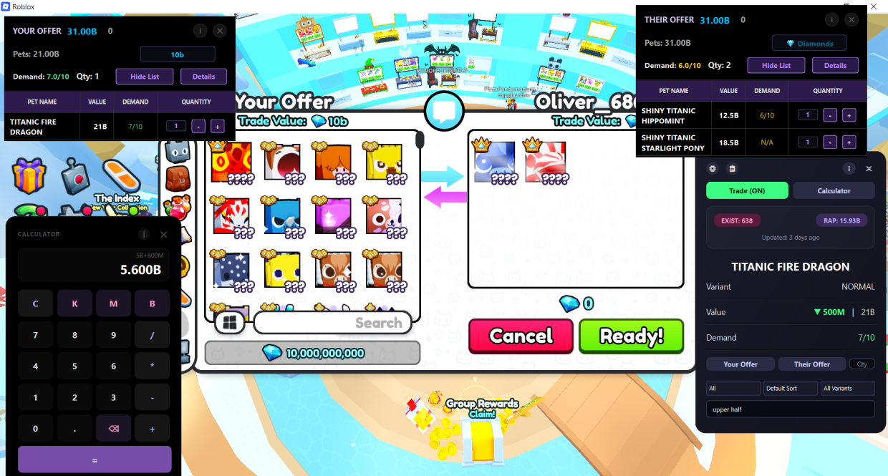

# 🐾 Pet Simulator 99 Trading Assistant

A powerful, computer-vision-powered desktop tool designed to help Pet Simulator 99 players make better trades by providing instant, real-time pet values.

---

## 🚀 What is this App?

This app is an **External Trading Assistant**. Instead of manually searching for prices on websites, you can simply hover over a pet in-game and press a key. The app "sees" what you are looking at and tells you exactly what it's worth.

### How it works:
1.  **Capture:** When you press a hotkey (Z or X), the app takes a high-speed screenshot of your Roblox window.
2.  **Analyze:** It uses advanced Computer Vision to find the pet "card" on your screen and highlights it.
3.  **Segment:** The app splits the image into parts: the **Name** area and the **Rarity** area, which you can see inside live folder.
4.  **Read:** Using OCR (Optical Character Recognition), it reads the text directly from the screenshot and matches it with a local database of Cosmic Values.(will be removing cosmic values database shortly and adding more value lists)

---

## ⚖️ Is this allowed? (Roblox TOS)

**YES.** This app is 100% safe to use and **does not violate Roblox Terms of Service.**

*   **Not a Hack/Exploit:** This app **never** modifies game files, injects code, or reads Roblox's internal memory. It is entirely external.
*   **Read-Only:** It simply "looks" at your screen, just like a human player does. It's essentially the same as taking a screenshot and looking at a price guide on a second monitor.
*   **Non-Invasive:** It does not automate gameplay or provide an unfair mechanical advantage (it doesn't play the game for you).
*   **Lightweight:** The app is highly optimized, using **less than 50MB of RAM** and **under 1% CPU usage**, so it won't slow down your game.

According to the [Roblox Terms of Use](https://en.help.roblox.com/hc/en-us/articles/115004647846-Roblox-Terms-of-Use), prohibited behavior usually involves "Exploiting" (modifying the game client). Since this tool only analyzes screenshots externally, it falls under the category of a **Third-Party Utility**, similar to Discord overlays or FPS counters.

---

## 💻 System Requirements

*   **Windows Only:** This app is designed specifically for Windows (10 or 11).
*   **Running the App:** 
    *   **EXE Version:** Simply run the provided `.exe` file.
    *   **Python Version:** Requires Python 3.10+ installed on your computer.

---

## ✨ Features & Limitations

### 🎯 Hover Detection
The "Hover to Find Value" feature is optimized for the most important items:
*   **Huges**
*   **Titanics**
*   **Gargantuans**

### ⌨️ Manual Search
For other items (Enchants, Potions, Misc items), you can use the **Search Box** in the app. Just type the name, press Enter, and the value will be displayed instantly.

---

## 📚 Further Documentation

For more detailed information, please check the following files:

*   📖 **[How to Use.md](./How%20to%20use.md)** - A step-by-step guide for players.
*   🛠 **[Requirements.md](./Requirements.md)** - How to install Python and necessary libraries.
*   ⚙️ **[Scripts.md](./Scripts.md)** - A detailed look at how every script in this project works.

---

*Disclaimer: This tool is an independent project and is not affiliated with Big Games or Roblox.*

## 💬 Community & Support
Join the Discord server for updates, support, and to chat with other traders:

---

## 📜 Usage & Credits
*   **Personal Use Only:** You can only use this app locally on your own computer.
*   **No Commercial Use:** You are **strictly prohibited** from selling this app, selling it as a service, or distributing it for profit in any way or format.
*   **Developed by:** [Manav/smanav225]
