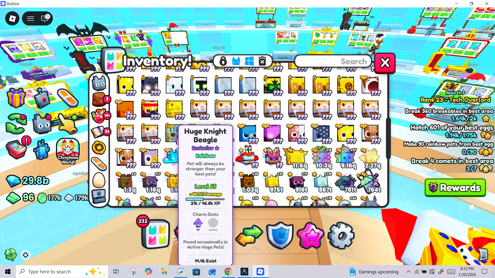
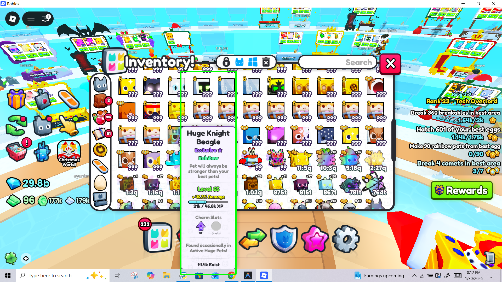
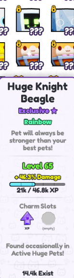
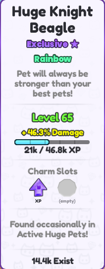

# ⚙️ Behind the Scenes: The Technical Workflow

This document provides a deep-dive into the complex multi-stage pipeline that powers the Pet Simulator 99 Trading Assistant. In the 0.5 seconds after you press a key, the app performs a series of advanced computer vision and data processing tasks.

---

### 1. The High-Speed "Stealth" Capture
The process begins with **hotkey monitoring**. The app uses the `win32api` to listen for your custom keys (Z/X) at a hardware level.

*   **Synchronized Stealth:** To ensure the app windows don't block the pet you are trying to see, the system triggers a "Stealth Mode." It sets the transparency of all windows to **0%**.
*   **DWM Buffer Clearing:** The app waits for exactly **0.12 seconds** to allow the Windows display buffer to clear.
*   **The Result:** A perfectly clean image called `original_screen.png`.

---

### 2. Identifying the ROI (`Image_detection.py`)
Now the app looks at the screenshot and needs to find the pet. It scans the image for the specific purple borders used in Pet Simulator 99.
*   **Density Mapping:** The app calculates the density of purple pixels to find the edges of the pet card.
*   **The Debug View:** It draws green highlight lines to show where it thinks the pet is located.
*   **The Result:** A visualization image called `debug_result.png`.

---

### 3. The Rough Crop (`capture0.png`)
Once the borders are found, the script performs the first extraction. 
*   This is a "rough" cut that captures the entire detected purple box.
*   It is created immediately after `Image_detection.py` identifies the region but before the final cleaning happens.
*   **The Result:** The raw pet card image called `capture0.png`.

---

### 4. Precision Frame Refining (`image_detection2.py`)
Even after finding the box, there might be "noise" around the edges. This script performs a **Micro-Crop**:
*   **Border Trimming:** It identifies the absolute highest and lowest white pixels of the nameplate.
*   **Cleaning:** It trims the image to these coordinates, removing the purple border entirely.
*   **The Result:** `capture1.png`—a perfect, clean rectangle containing only the pet's information.

🚀 **Milestone Reached:** The system has successfully isolated the data area. Now the name and rarity extraction begins.

---

### 5. Extracting the Name (`name_detection.py`)
To read the name, we have to isolate it from the rest of the card:
*   **Anchor Pointing:** The script looks for the "Exclusive" or "Huge" rarity tag and crops everything **above** it.
*   **Binary Enhancement:** It applies a high-contrast black and white filter to help the OCR "eye" read the letters perfectly.
*   **The Result:** `capture2.png`.

#### 🤖 The OCR Engine (EasyOCR)
The app passes `capture2.png` to **EasyOCR**. This is a Deep Learning model that recognizes characters and turns the image pixels into actual text like *"Huge Cat"*.

---

### 6. The Rarity Logic Path (`Rarity_type` Pipeline)
Determining the variant (Golden, Rainbow, Shiny) is a complex 6-step process (Step 1 to Step 6):
*   **Shiny Detection:** It scans for specific pink/peach pixels.
*   **Rainbow Entropy:** It counts unique RGB colors. If it finds more than 80 different shades in the text, it confirms the pet is **Rainbow**.
*   **The Result:** The finalized rarity snip called `capture3.png`.

---

### 7. Fuzzy Matching & Final Lookup (`App.py`)
Finally, all the pieces come together:
*   **Fuzzy Matching:** It uses `RapidFuzz` to fix any small reading mistakes by the OCR.
*   **Database Query:** It searches the local database for the Name + Variant combination.
*   **The Result:** The final values are calculated and displayed on your screen!

---

*All processed images can be found in the `Images` folder to help you visualize the transformation.*
